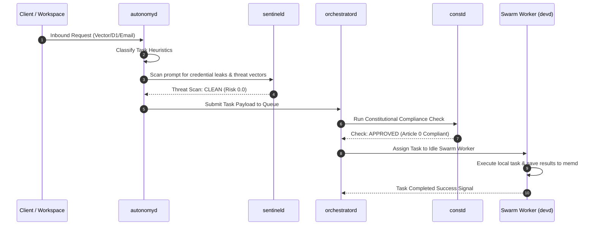

# ◈ Creative Liberation Engine — Sovereign Agentic OS (Private Repository)

[](https://opensource.org/licenses/Apache-2.0)
[](https://turbo.build/)
[](https://pnpm.io/)
[](https://modelcontextprotocol.io/)

> **"Does this make artists more free or less free?"**  
> — *Article 0, The Sovereign Foundation Constitution*

---

The **Creative Liberation Engine (CLE)** is a high-performance, self-hosted, sovereign Agentic OS designed for digital artists, independent studios, and developers. It runs entirely on your owned local hardware, indexes memory locally in a secure vector spine, and coordinates local models to accelerate creative workflows (code, script, audio, and motion synthesis) without corporate surveillance, cloud lock-in, or extraction.

CLE is built from the ground up as a pristine **UNIX-style daemon cluster** (denoted by the `*d` suffix) where each capability runs as a modular, lightweight process, fully independent and contract-bound.

---

## 🏛 The 3x3 Sovereign Cluster Topology

On initial boot, the setup wizard dashboard maps and stabilizes a robust **9-node core cluster** forming the architectural bedrock of your local operations:

```
           ┌───────────────────────────────────────────────┐
           │          CREATIVE LIBERATION ENGINE           │
           │        3x3 Sovereign Cluster Topology         │
           └───────────────────────────────────────────────┘
                     
     [ memd ]  ───────────  [ constd ]  ───────────  [ orchestratord ]
  (Memory Spine)           (Governance)             (UNIX Swarm)
        │                       │                        │
     [ physicaltwind ] ───  [ authmdhubd ]  ───────  [ sentineld ]
  (BIM ConTech)            (Auth & OARP)            (Threat Guard)
        │                       │                        │
     [ hardeningd ]  ─────  [ autonomyd ]  ────────  [ aegis-sense ]
  (Helix Audit)            (Autonomy)               (Subnet Probe)
```

---

## 📦 Monorepo Architecture: The 14-Package Cluster

CLE is structured as a Turborepo monorepo with 14 fully independent packages, maintaining complete separation between core system daemons (`packages/*`) and swarm worker daemons (`services/*`):

| Package / Daemon | Tier | Purpose | Stack |
| :--- | :---: | :--- | :--- |
| **`packages/appd`** | Core UI | Tauri v2 desktop companion shell & glassmorphic dashboard container | Rust + Tauri v2 + React |
| **`packages/deviced`** | Core System | Aegis-Sense prober scanning CPU/GPU limits & local subnet topology | TypeScript + Rust |
| **`packages/orchestratord`** | Core Swarm | Master task scheduler, dispatcher, and active queue router | TypeScript |
| **`packages/memd`** | Core Memory | Offline high-speed memory spine (SQLite + Vector document index) | SQLite + Vector |
| **`packages/constd`** | Core Gov | Constitutional safety gatekeeper, validating agent safety rules | TypeScript |
| **`services/physicaltwind`** | ConTech | BIM variance tracker comparing physical-twin scans vs blueprints | Express + Pino |
| **`services/authmdhubd`** | Auth / Identity | Open Agent Registration Protocol (OARP) auth.md hub | Express + Pino |
| **`services/sentineld`** | Security | Zero-trust input threat guard scanning prompts for key leaks & hacks | Node 22 + ESM |
| **`services/hardeningd`** | Security | Hardening auditor verifying the 30 Controls across 6 Helices | Express + JSON |
| **`services/autonomyd`** | Autonomy | Workspace Autonomy daemon (email triage & webhook watcher) | TypeScript |
| **`services/devd`** | Swarm Worker | Developer agent writing code, reasoning, and building software | TS / Node |
| **`services/scribed`** | Swarm Worker | Scribe agent writing scripts, copy, and documentation | TS / Node |
| **`services/foleyd`** | Swarm Worker | Foley agent synthesizing ambient soundscapes and creative audio | TS / Node |
| **`services/animatord`** | Swarm Worker | Animator agent mapping 3D coordinate motion and rendering | TS / Node |

---

## 🔄 Task Lifecycle Flow

Here is how an incoming creative request is routed autonomously through the zero-trust cluster:



---

## 🛠 Pre-requisites & Local Environment

To boot the high-performance local cluster, your system must have:
* **Node.js v22.0.0+** (Required for native typescript type stripping `--experimental-strip-types`)
* **PNPM v8.15.0+** (Workspace manager)
* **Rust Toolchain (Stable)** (Required to compile native `deviced` bindings and Tauri shell)
* **Local LLM Runner (Recommended)** (e.g. Ollama running Llama 3 or Mistral locally)

---

## 🚀 Installation & Boot

### 1. Bootstrap the Monorepo
Clone the repository and install all dependencies in a single workspace link step:
```bash
git clone https://github.com/Creative-Liberation-Engine/creative-liberation-engine.git
cd creative-liberation-engine
pnpm install
```

### 2. Compile All Packages
Verify TypeScript integrity and build all packages recursively in under 5 seconds using Turborepo:
```bash
pnpm run build
```

### 3. Launch Aegis-Sense Discovery Server
You can launch the Aegis-Sense discovery server directly via STDIO to expose local hardware & network probers to Cortex or other strategic clients:
```bash
cd packages/deviced
node --experimental-strip-types src/mcp_server.ts
```

### 4. Boot the Setup Dashboard UI
To view the immersive glassmorphic cluster status grid and initialize system configurations:
```bash
cd apps/dashboard
pnpm run dev
```
Open [http://localhost:3000](http://localhost:3000) in your browser.

---

### 🏛 Licensing

This project is licensed under the terms of the **Apache License 2.0**. See the [LICENSE](LICENSE) file for the full terms and conditions.

---

### ✉ Contact

For partnerships, inquiries, or community coordination, reach out to:
**contact@creative-liberation-engine.org**