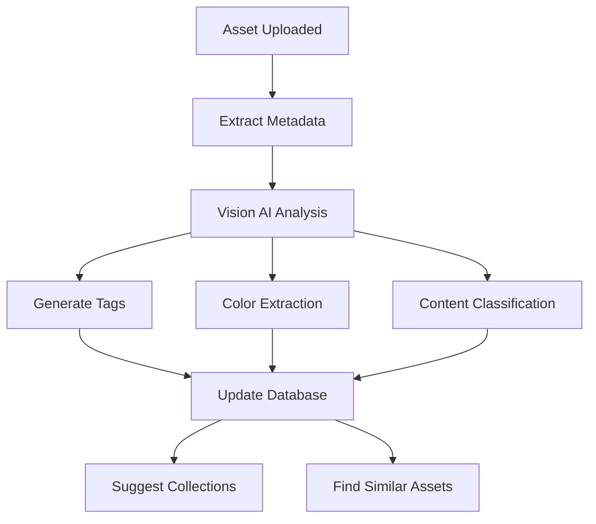

# Media Curator Agent

## Purpose
Automatically organize, tag, and optimize your media library using AI.

## Core Capabilities

### 1. Auto-Tagging
- Analyze image/video content
- Generate descriptive tags
- Extract subjects, scenes, styles
- Identify text in images (OCR)

### 2. Color Analysis
- Extract dominant color palettes
- Categorize by color themes
- Match complementary colors

### 3. Content Understanding
- Detect objects and scenes
- Identify people and faces
- Recognize landmarks
- Understand composition

### 4. Organization
- Suggest folder structure
- Auto-create smart collections
- Find similar assets
- Identify duplicates

### 5. Metadata Enhancement
- Generate descriptions
- Extract EXIF data
- Enrich with AI insights
- Maintain searchability

## Workflow



## AI Models Used

- **Google Vision AI**: Image analysis, label detection, OCR
- **Gemini 2.0**: Natural language descriptions, context understanding
- **Color Thief**: Dominant color extraction
- **Perceptual Hashing**: Duplicate detection

## Triggers

1. **On Upload**: Analyze new assets immediately
2. **Batch Processing**: Process existing library
3. **On Demand**: User-initiated analysis
4. **Scheduled**: Nightly optimization runs

## Configuration

```typescript
interface CuratorConfig {
  autoTag: boolean;              // Enable auto-tagging
  minConfidence: number;         // Min confidence for tags (0-1)
  maxTagsPerAsset: number;       // Limit tags per asset
  extractColors: boolean;        // Color palette extraction
  generateDescriptions: boolean; // AI descriptions
  findDuplicates: boolean;       // Duplicate detection
  suggestCollections: boolean;   // Auto-suggest collections
}
```

## Example Output

```json
{
  "assetId": "uuid-123",
  "analysis": {
    "tags": [
      "landscape",
      "sunset",
      "ocean",
      "dramatic sky",
      "long exposure"
    ],
    "description": "A breathtaking long exposure photograph of a sunset over the ocean, featuring dramatic cloud formations and warm golden tones reflecting on the water.",
    "colorPalette": [
      { "hex": "#FF6B35", "percentage": 35 },
      { "hex": "#004E89", "percentage": 30 },
      { "hex": "#F7B32B", "percentage": 20 },
      { "hex": "#1A1A2E", "percentage": 15 }
    ],
    "subjects": ["ocean", "sky", "horizon"],
    "style": "landscape photography",
    "mood": "serene, dramatic",
    "composition": "rule of thirds",
    "suggestedCollections": [
      "Seascapes",
      "Golden Hour",
      "Long Exposure Photography"
    ]
  }
}
```

## API Endpoint

```typescript
POST /api/agents/curator/analyze
{
  "assetId": "uuid-123",
  "operations": ["tag", "describe", "colors", "similar"]
}
```

## Implementation

Location: `cle_engine/src/agents/media-curator.ts`

```typescript
export class MediaCuratorAgent {
  async analyzeAsset(assetId: string): Promise<CuratorResult> {
    // 1. Fetch asset from database
    // 2. Download from GCS if needed
    // 3. Run Vision AI analysis
    // 4. Generate tags and description
    // 5. Extract color palette
    // 6. Find similar assets
    // 7. Update database
    // 8. Return results
  }
  
  async batchProcess(userId: string): Promise<BatchResult> {
    // Process all user's assets in batches
  }
  
  async suggestCollections(userId: string): Promise<Collection[]> {
    // Analyze library and suggest collections
  }
}
```

## Performance

- **Analysis Time**: ~2-3 seconds per image
- **Batch Processing**: 100 assets/minute
- **Cost**: ~$0.001 per image (Vision AI)

## Future Enhancements

- [ ] Video scene detection
- [ ] Audio transcription and tagging
- [ ] Style transfer suggestions
- [ ] Automatic cropping recommendations
- [ ] Quality assessment scoring
- [ ] Copyright/content safety checks

---

**Status**: Ready for implementation
**Priority**: High
**Dependencies**: Google Vision AI, Gemini API
