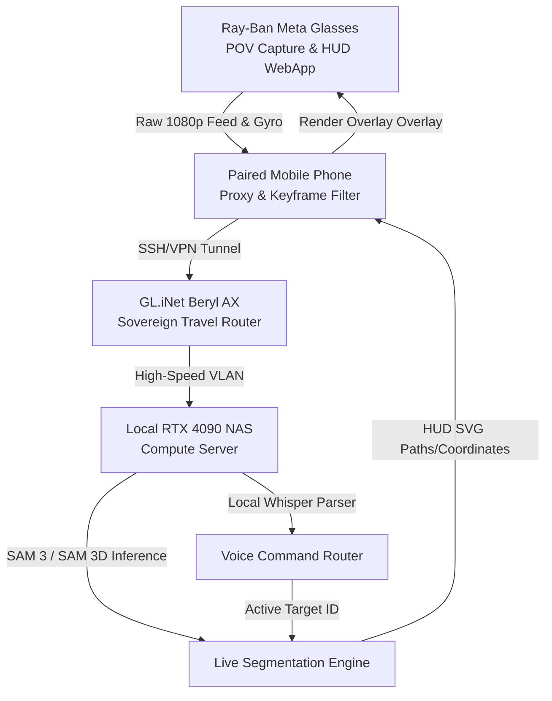

# 🧠 Spatial Ideation Blueprint: SAM 3D Live Event Engine
## Creative Liberation Engine V6 Spatial & Computer Vision Strategy

> **Author:** AVERI (ATHENA / VERA / IRIS)  
> **Stance:** CREATIVE DIRECTORS | **Priority:** High  
> **Target Document:** [SPATIAL_SAM3D_IDEATION.md](file:///y:/creative-liberation-engine/designs/SPATIAL_SAM3D_IDEATION.md)  
> **Core Objective:** Establish a robust framework to capture real-time POV visual streams from Ray-Ban Meta glasses, process them through high-performance SAM 3 / SAM 3D spatial models on the home NAS, and project live segmentation masks and interactive HUD overlays back to the operator.

---

## 1. The Core Vision: Spatial Pre-Segmentation

In live sports, theater, and multi-camera broadcasts, the primary bottleneck is **spatial tracking friction**. Setting up dedicated tracking rigs (Lidar, UWB, or multi-camera optical arrays) is expensive and non-sovereign. 

By utilizing **Ray-Ban Meta Smart Glasses** as dynamic, mobile POV capture nodes paired with **Segment Anything 3 / SAM 3D** models running on our local **RTX 4090 NAS inference node**, we can implement **"Pre-Segmentation"**. 

Instead of post-processing video feeds in post-production, an operator wearing the glasses segments the physical world *live* through simple voice commands (*"Track player 7"*, *"Segment lead dancer"*, *"Isolate target object"*). The engine builds real-time 3D meshes of athletes or actors, allowing instant broadcast graphic overlays, interactive replays, or automatic DMX stage lighting follows.

```
       [ Ray-Ban Meta Glasses ]           [ Mobile Phone Edge Bridge ]
       - POV Camera Stream (1080p) ------> - Initial Keyframe Filter
       - HUD Display Visuals <----------- - local Websocket Tunnel
                 ^                                   │
                 │ (HUD Coordinates/SVG Masks)       │ (Buffered Stream)
                 └───────────────────┐               ▼
                               [ Local 4090 NAS Compute Server ]
                               - local Whisper (Voice Triggers)
                               - SAM 3D Objects & Bodies (Inference)
                               - Memory Spine (RAG logging)
```

---

## 2. Wide-Ranging Use Cases

### A. Live Sports & Performance Analytics (Barnstorm SOC)
* **Real-time Form Estimation (SAM 3D Body):** Reconstruct an athlete's physical pose and joint angles directly from the first-person perspective. A coach or physical therapist wearing the glasses gets instant skeletal wireframe overlays showing joint stress, speed trajectories, and vertical jump metrics.
* **Pre-Segmented Live Graphics Keying:** Segment players and ball trajectories instantly. Broadcast switches (OBS/vMix) connected to the local NAS can apply visual effects (glows, trailing paths, name tags) underneath or behind players in real-time, bypassing green screens.

### B. Live Stage Direction & Lighting Autonomy (Events)
* **Spatial DMX Spotlights:** An operator locks eyes with a performer and taps the glasses frame to "Target." SAM 3D identifies the performer’s physical mesh, calculates their coordinates relative to stage coordinates, and automatically guides the stage DMX motorized spotlights to follow them dynamically.
* **Virtual Visual Scribing:** The stage director "draws" in the air or looks at a specific physical spot on stage, saying *"Mark light cue 3."* The system stores this spatial coordinates node in the **Memory Spine**, projecting a virtual marker on the glasses' in-lens HUD only, preventing stage clutter while coordinating the technical run-of-show.

### C. The "Spatial Atelier" (Creative Studio Capture)
* **Hands-Free Photogrammetry:** A sculptor, modeler, or set designer walks around a physical object. The glasses stream the circular POV feed. SAM 3D isolates the object from the background noise, and passes the clean segmented frames to our local NeRF/Gaussian Splatting pipeline on the NAS, creating a high-fidelity 3D digital twin within minutes.
* **Visual Anchor Matching:** Look at a canvas or design mockup. The HUD overlays our active design library guidelines (`ATELIER/design-library/`) directly over the physical model to verify grid alignments and color palettes.

---

## 3. The Real-Time Split-Compute Architecture

To run heavy spatial segmentation models like SAM 3D without draining the glasses' battery or introducing latency, we implement a **Split-Compute Mesh topology** (`WS-04`):



### A. Edge Filtering & Buffer Management (The Phone Proxy)
* **Visual Data Minimization:** The paired phone runs a lightweight frame-difference algorithm. If the operator's head is stationary, the proxy reduces transmission to 5 frames-per-second, saving battery.
* **Offline Spooling:** When working in low-signal arenas or stadiums, the phone caches raw POV footage in a secure local sandbox, uploading in high-speed batches once the sovereign travel VLAN reconnects.

### B. Local High-Throughput Inference (The 4090 NAS Server)
* **SAM 3 Video Tracking:** The NAS runs Meta's SAM 3 (Segment Anything 3) video pipeline in memory, using TensorRT optimization for sub-30ms frame-level tracking.
* **Multi-Model Fusion:** The NAS correlates SAM 3D meshes with **Twelve Labs MCP** video analysis, categorizing the action ("dribble", "sprint", "stage entrance") to auto-tag the logged Memory Spine records.

---

## 4. Operational Roadmap

We propose launching **"Project Spatial-Lens"** inside V6 as a flagship capability, bridging WS-04, WS-07, and WS-09:

* **Milestone 1 (Sprint 1): The Local Video Stream Gateway**
  Establish a secure WebRTC/WebSocket pipeline from the paired mobile phone to the NAS `gateway/` service, streaming low-latency video and receiving overlay paths.
* **Milestone 2 (Sprint 2): SAM 3 integration**
  Deploy SAM 3 within a dedicated Docker container on the NAS, processing the incoming stream and returning JSON-based bounding box and segmentation mask arrays.
* **Milestone 3 (Sprint 3): HUD Overlay Render**
  Render the coordinates as dynamic, spring-animated SVG overlays (using glassmorphism tokens from `docs/DESIGN.md`) inside the glasses' Web App HUD.
* **Milestone 4 (Sprint 4): Live Event Test**
  Deploy at a Barnstorm live performance, tracking actors and automating a DMX spotlight based purely on glasses POV coordinates.

---

> [!IMPORTANT]
> **Sovereignty Statement:** Under V6 Constitution Article I, we do not upload spatial video feeds to public cloud services. The visual stream is isolated within the local VLAN mesh, securing the physical privacy of athletes, performers, and operators.
