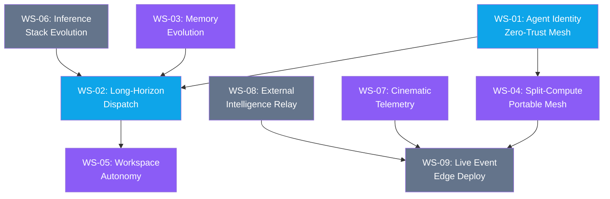

# 🧠 IDEATION Agenda — Creative Liberation Engine V6 Evolution

> **Date:** 2026-04-30
> **Phase:** Post-Phase 7 (SHIP) — All foundation phases complete
> **Source:** Gemini brainstorm sessions (9 conversations) + V6 codebase audit
> **Protocol:** IDEATE → route to PLAN (infrastructure) or DESIGN (product/experience)

---

## Executive Summary

V6 is architecturally mature: 7 phases complete, 83 capabilities in parity matrix, contract-first governance operational. The brainstorm ideas from your Gemini sessions fall into **three strategic tiers**:

| Tier | Description | Count |
|------|-------------|-------|
| 🔴 **Already Built** | V6 has this or a strong foundation for it | 8 concepts |
| 🟡 **Partially Covered** | Foundation exists, needs extension | 9 concepts |
| 🟢 **Net-New** | Requires new architecture or capability | 8 concepts |

> [!NOTE]
> **Gemini Source Links:** All 9 Gemini conversation links are auth-gated and returned generic login pages when fetched. Content could not be independently verified. The concepts below are evaluated on their own merit against V6's codebase — not on the assumption that the source descriptions are accurate.

---

## V6 Current State Snapshot

| Dimension | Status |
|-----------|--------|
| **Phases** | 7/7 complete ✅ |
| **Capabilities** | 83 total (12 native V6, 71 V5-bridge, 6 "better") |
| **Services (live)** | 20+ (dispatch, genkit, pulse, harvesters, cortex-chat-bridge, chrome-agent, sentinel, etc.) |
| **Apps** | 7 (cle-hud, engine-room, nexus-canvas, etc.) |
| **Skills Matrix** | 35 target skills across 7 families (Batch-35) |
| **Open Items** | 8 capability ideations with blocking questions (OPEN_ITEMS.md) |
| **Strategic Thesis** | Domain-reality-modeling platform, not a tool |
| **Hardware** | RTX 4090 (24GB), Ryzen 9 5950X, 128GB RAM, UGREEN NAS |

---

## Gap Analysis: Brainstorm vs V6 Reality

### Category 1 — Core Architecture & Sovereign Philosophy

| Concept | V6 Status | Gap |
|---------|-----------|-----|
| Zero-Trust Networking | 🟡 VLAN topology exists ([barnstorm_vlan_topology.md](file:///d:/Google%20Antigravity/Infusion%20Engine%20Brainchild/creative-liberation-engine/docs/barnstorm_vlan_topology.md)), auth policies in routing contract | No mTLS between services, no agent-level cert identity |
| Sovereign Memory (Qdrant + Dolt) | 🟡 Memory Spine uses ChromaDB + filesystem. Qdrant/Dolt not integrated | ChromaDB works; Qdrant would be an upgrade, Dolt adds versioned SQL |
| Failsafes & Self-Healing | 🟡 [LONG_HORIZON_DISPATCH.md](file:///d:/Google%20Antigravity/Infusion%20Engine%20Brainchild/creative-liberation-engine/docs/LONG_HORIZON_DISPATCH.md) specifies L1-L3 failure recovery, checkpoint/resume | Spec exists but implementation deferred — not yet built |
| Data Sovereignty vs Cloud | 🔴 Model registry already has local/cloud tiering. Sovereignty Score metric defined in [VALUE_METRICS.md](file:///d:/Google%20Antigravity/Infusion%20Engine%20Brainchild/creative-liberation-engine/docs/VALUE_METRICS.md) | Relay agent for cloud offloading is net-new |
| NAS as Sovereign OS | 🔴 Already operational — NAS is the deployment target, Tier 1 SSH, Cloudflare tunnels | Done |
| Agent Identity Verification | 🟡 Agent registry exists (`agents.canonical.json`), but no cryptographic IDs | Need PKI or JWT-based agent identity |
| Agentic Mesh (Stationary + Handheld) | 🟢 `mobile-bridge` service exists but is a stub | Full split-compute topology is net-new |
| Zero-Config Sovereign Bubble | 🟢 No portable router / travel LAN infrastructure | Net-new hardware + software layer |
| Split-Compute Topology | 🟢 Conceptual only — no orchestration ↔ edge-compute split | Net-new architecture |

### Category 2 — Autonomous Orchestration & Swarm Intelligence

| Concept | V6 Status | Gap |
|---------|-----------|-----|
| Orchestration Brain (Genkit + LangGraph) | 🔴 Genkit is native V6, `genkit` service deployed | LangGraph not integrated (Genkit handles orchestration) |
| Trigger-Based Agents | 🟡 Dispatch handles task queue, `nas-watcher` exists | No plain-English trigger definitions yet |
| A2A & H2A Workflows | 🟡 Dispatch routes tasks, but agents don't coordinate directly | Claw Groups pattern from K2.6 spec would address this |
| Workspace Orchestration | 🟡 CORTEX chat bridge + harvesters partially cover this | Gmail/Calendar autonomous management not yet wired |
| Automated Meeting Participation | 🟢 CORTEX bridge exists but doesn't join calls | Whisper + Meet join is net-new |
| Live Event Agentic SOC | 🟢 No event-specific edge deployment | Builds on split-compute + portable mesh |

### Category 3 — Frameworks & System Integrations

| Concept | V6 Status | Gap |
|---------|-----------|-----|
| vLLM + Temporal.io | 🟡 Ollama is the inference server, no Temporal | vLLM would replace Ollama for production; Temporal would replace ad-hoc state |
| Capability Orbs Directory | 🟡 Skills registry + parity matrix cover this structurally | Visual "Orbs" UI is a DESIGN concern |
| Digital Twin / Photogrammetry | 🟢 No BIM/point-cloud pipeline | Entirely new vertical |
| Twelve Labs MCP Integration | 🟡 Barnstorm Intelligence exists, Genkit pipeline operational | TwelveLabs API connector is net-new |
| Playwright + Antigravity Bindings | 🔴 `chrome-agent` service exists, Playwright already in use | Largely done |
| NAS API Server | 🔴 dispatch server + genkit + registry-api all serve this | Done |
| Sandboxed Execution | 🟡 Conceptual in OPEN_ITEMS.md (rollback tolerance question) | No formal sandbox runtime |
| iOS Sandboxing Constraints | 🔴 Already documented in conversation history — iOS not a controllable node | Known limitation, documented |

### Category 4 — UI/UX & Deployment Strategy

| Concept | V6 Status | Gap |
|---------|-----------|-----|
| Cinematic UI/UX | 🟡 DESIGN.md tokens defined, Sentinel Command exists | Radar Sweep / Capability Orbs / Telemetry Matrix not built |
| Google Chat as Primary UI | 🟡 CORTEX chat bridge operational | Not yet a full command surface |
| Generative UI | 🟡 `gen-ui` package exists (V5 bridge), Flash UI port in progress | Needs Gemini 3.1 Flash integration |
| Gaming Handhelds as Tactical Glass | 🟢 No handheld-specific UI or deployment | Net-new hardware + software surface |

---

## Consolidated IDEATION Workstreams

The 25 raw concepts collapse into **9 actionable workstreams**, ordered by strategic impact and dependency chain:

---

### WS-01: Sovereign Agent Identity & Zero-Trust Mesh
**Route:** PLAN | **Priority:** P0 | **Effort:** 3-4 sessions

**What:** Assign cryptographic identities to agents. Implement mTLS between NAS services. Enforce zero-trust at the service mesh level.

**V6 Foundation:**
- Agent registry (`agents.canonical.json`) — names exist, no keys
- Auth policies in routing contract — 5 tiers defined
- VLAN topology for Barnstorm — network isolation designed

**Deliverables:**
1. PKI certificate generation per agent (self-signed CA on NAS)
2. mTLS enforcement between dispatch ↔ genkit ↔ pulse ↔ memory-api
3. Agent identity verification middleware for high-stakes dispatch tasks
4. Update `ROUTE_CONTRACT.schema.json` with cert-pinning fields

**Brainstorm concepts absorbed:** Zero-Trust Networking, Agent Identity Verification

---

### WS-02: Long-Horizon Dispatch Implementation
**Route:** PLAN | **Priority:** P0 | **Effort:** 5-6 sessions

**What:** Build the checkpoint/resume, heartbeat, and failure recovery protocols already specified in [LONG_HORIZON_DISPATCH.md](file:///d:/Google%20Antigravity/Infusion%20Engine%20Brainchild/creative-liberation-engine/docs/LONG_HORIZON_DISPATCH.md).

**V6 Foundation:**
- Complete spec exists (checkpoint data contract, heartbeat schema, resource budgets, priority lanes)
- Dispatch service is operational
- PostgreSQL persistence layer defined in routing contract

**Deliverables:**
1. Checkpoint/resume protocol in dispatch service
2. Heartbeat monitoring daemon
3. Resource budgeting enforcement (GPU minutes, API calls, tokens)
4. L1/L2 failure recovery (self-healing + dispatch reassignment)
5. Parent-child task graph for swarm coordination

**Brainstorm concepts absorbed:** Failsafes & Self-Healing, A2A Workflows, Swarm Intelligence

---

### WS-03: Sovereign Memory Evolution (Qdrant + Versioning)
**Route:** PLAN | **Priority:** P1 | **Effort:** 3-4 sessions

**What:** Evaluate replacing ChromaDB with Qdrant for the vector layer. Add Dolt or git-based versioning for memory records. Strengthen the Memory Spine.

**V6 Foundation:**
- [MEMORY_SPINE.md](file:///d:/Google%20Antigravity/Infusion%20Engine%20Brainchild/creative-liberation-engine/docs/MEMORY_SPINE.md) — complete lifecycle, 7 providers, retention classes
- ChromaDB operational for RAG
- Memory contract schema validated

**Deliverables:**
1. Qdrant vs ChromaDB benchmark on V6 embedding workloads
2. If Qdrant wins: migration path with zero-downtime cutover
3. Memory record versioning (git-backed or Dolt SQL layer)
4. Semantic deduper activation (`semantic-deduper` skill from Batch-35)

**Brainstorm concepts absorbed:** Sovereign Memory (Qdrant + Dolt)

---

### WS-04: Split-Compute & Portable Mesh Architecture
**Route:** PLAN | **Priority:** P2 | **Effort:** 6-8 sessions

**What:** Design the topology where a handheld device (ROG Ally 2 / Steam Deck / phone) orchestrates while the NAS or edge node computes. Includes the "zero-config sovereign bubble" travel LAN.

**V6 Foundation:**
- `mobile-bridge` service (stub)
- Cloudflare tunnel infrastructure
- NAS compute topology

**Deliverables:**
1. Split-compute protocol spec (orchestration ↔ inference separation)
2. GL.iNet Beryl AX travel router configuration for persistent LAN
3. `mobile-bridge` service hardened with WebSocket + SSE channels
4. Handheld discovery protocol (mDNS/Bonjour on sovereign bubble)
5. Battery-aware compute delegation (handheld offloads heavy inference)

**Brainstorm concepts absorbed:** Agentic Mesh, Zero-Config Sovereign Bubble, Split-Compute Topology, Gaming Handhelds

> [!WARNING]
> This is the highest-effort workstream and depends on WS-01 (agent identity) for secure mesh communication. Do not start before WS-01 ships.

---

### WS-05: Workspace Autonomy Layer (Gmail/Calendar/Meet)
**Route:** PLAN | **Priority:** P1 | **Effort:** 4-5 sessions

**What:** Extend CORTEX from a chat bridge to a full workspace orchestrator — autonomous email triage, calendar management, and meeting participation.

**V6 Foundation:**
- `cortex-chat-bridge` service operational
- Google Workspace MCP tools available
- Harvesters running for knowledge ingestion

**Deliverables:**
1. Gmail triage agent (label, archive, draft replies based on rules)
2. Calendar optimizer (detect conflicts, suggest rescheduling)
3. Meeting participant agent (join Meet, stream audio to Whisper, produce transcript + action items)
4. Google Chat as command surface (natural language → dispatch task)

**Brainstorm concepts absorbed:** Workspace Orchestration, Automated Meeting Participation, Google Chat as Primary UI

---

### WS-06: Inference Stack Evolution (vLLM + Temporal)
**Route:** PLAN | **Priority:** P2 | **Effort:** 4-5 sessions

**What:** Evaluate vLLM as a production inference server (replacing Ollama for high-throughput). Evaluate Temporal.io for workflow state management (replacing ad-hoc dispatch state).

**V6 Foundation:**
- Ollama operational on both workstation and NAS
- [GPU_GROWTH_PLAN.md](file:///d:/Google%20Antigravity/Infusion%20Engine%20Brainchild/creative-liberation-engine/docs/GPU_GROWTH_PLAN.md) — 4 milestones defined
- Model registry with tier abstraction (swap-ready)

**Deliverables:**
1. vLLM benchmark vs Ollama on RTX 4090 (throughput, latency, multi-request)
2. If vLLM wins: Docker deployment on NAS, model registry adapter
3. Temporal.io evaluation for dispatch workflow state
4. Decision document: migrate dispatch to Temporal or keep custom

**Brainstorm concepts absorbed:** vLLM, Temporal.io, Inference & Execution Layers

---

### WS-07: Cinematic Telemetry Dashboard
**Route:** DESIGN | **Priority:** P1 | **Effort:** 4-5 sessions

**What:** Build the "Radar Sweep + Capability Orbs + Live Telemetry Matrix" visualization layer. Transform Sentinel Command from a feed reader to a cinematic operational HUD.

**V6 Foundation:**
- [DESIGN.md](file:///d:/Google%20Antigravity/Infusion%20Engine%20Brainchild/creative-liberation-engine/DESIGN.md) — full token system, glassmorphism protocol, animation specs
- Sentinel Command already deployed (conversation `7c6fb848`)
- OPEN_ITEMS.md Question: "Pitch Black Brutalist" vs "Sonar/Radar" palette

**Deliverables:**
1. WebGL/Canvas-based radar sweep showing live agent mesh topology
2. Capability Orbs — interactive skill directory with real-time status
3. Telemetry matrix — dispatch throughput, sovereignty score, model usage
4. Spring-based micro-animations per DESIGN.md spec
5. ROG Ally 2 viewport optimization (1920x1080 touch interface)

**Brainstorm concepts absorbed:** Cinematic UI/UX, Capability Orbs, Gaming Handhelds as Tactical Glass

---

### WS-08: External Intelligence Relay (Twelve Labs + Cloud Offload)
**Route:** PLAN | **Priority:** P2 | **Effort:** 2-3 sessions

**What:** Build a "Relay" agent pattern for secure cloud offloading. First target: Twelve Labs video indexing for Barnstorm Intelligence.

**V6 Foundation:**
- Barnstorm Intelligence app (conversation `e6c4fd12`)
- Genkit orchestration with Gemini 1.5 Pro
- NAS media server (Nginx) serving 1000+ RAW files

**Deliverables:**
1. Relay agent contract (local proxy that mediates all cloud API calls)
2. Data minimization rules (what leaves the mesh, what stays local)
3. Twelve Labs MCP connector via relay pattern
4. Audit trail for every cloud-offloaded operation

**Brainstorm concepts absorbed:** Twelve Labs MCP, Data Sovereignty vs Cloud, Cloud Relay Pattern

---

### WS-09: Live Event Edge Deployment (Agentic SOC)
**Route:** DESIGN → PLAN | **Priority:** P3 | **Effort:** 6-8 sessions

**What:** Package the Creative Liberation Engine for field deployment at Barnstorm live events. Edge node monitors feeds, manages vendor communications, orchestrates run-of-show.

**V6 Foundation:**
- Barnstorm VLAN topology designed
- Portable mesh concepts (WS-04 dependency)
- NAS as sovereign OS base

**Deliverables:**
1. "Event Kit" hardware spec (Mac Mini M4 + travel router + portable storage)
2. Containerized deployment package (offline-first, sync-when-connected)
3. Run-of-show orchestration agent
4. Vendor email automation agent
5. Live feed monitoring dashboard (subset of WS-07 telemetry)

**Brainstorm concepts absorbed:** Live Event Agentic SOC, NAS as Sovereign OS

> [!IMPORTANT]
> This workstream depends on WS-04 (portable mesh) and WS-07 (telemetry dashboard). It's the capstone deployment scenario.

---

## Dependency Graph

**Legend:** 🔵 P0 (start now) | 🟣 P1 (next sprint) | ⚫ P2-P3 (backlog)

---

## Concepts NOT Promoted to Workstreams

| Concept | Reason | Action |
|---------|--------|--------|
| Digital Twin / Photogrammetry | Entirely new vertical, no V6 foundation | Park — revisit when Barnstorm has LiDAR hardware |
| LangGraph | Genkit already serves as orchestration engine | No action — Genkit is the winner |
| iOS Node Integration | Apple sandboxing makes this impossible | Documented limitation, no action |
| Generative UI (gen-ui) | Already a V5-bridge capability, Flash UI port active | Tracked in existing conversation `2111f700` |
| Sandboxed Execution | Covered by WS-02 (checkpoint/rollback) | Absorbed into Long-Horizon Dispatch |

---

## Recommended Execution Order

| Sprint | Workstream | Sessions | Gate |
|--------|-----------|----------|------|
| **Sprint 1** | WS-01: Agent Identity | 3-4 | mTLS between 2+ services verified |
| **Sprint 2** | WS-02: Long-Horizon Dispatch | 5-6 | Checkpoint/resume passes e2e test |
| **Sprint 3** | WS-03: Memory Evolution | 3-4 | Qdrant decision made, migration or stay |
| **Sprint 3** | WS-07: Cinematic Telemetry | 4-5 | Radar sweep renders live agent data |
| **Sprint 4** | WS-05: Workspace Autonomy | 4-5 | Gmail triage agent operational |
| **Sprint 5** | WS-04: Split-Compute Mesh | 6-8 | Handheld connects to NAS over travel LAN |
| **Sprint 5** | WS-06: Inference Evolution | 4-5 | vLLM benchmark complete |
| **Sprint 6** | WS-08: External Relay | 2-3 | Twelve Labs connector via relay |
| **Sprint 7** | WS-09: Live Event SOC | 6-8 | Field-deployable event kit |

**Total estimated sessions: 36-48**

---

## Strategic Alignment Check

Every workstream maps to the [Strategic Thesis](file:///d:/Google%20Antigravity/Infusion%20Engine%20Brainchild/creative-liberation-engine/docs/STRATEGIC_THESIS.md):

> "CLE doesn't compete on model capability. It competes on domain-specific reality modeling."

| Layer | Workstreams |
|-------|------------|
| **Platform (Commodity)** | WS-06 (inference stack is swappable) |
| **Reality Model (Moat)** | WS-03 (memory), WS-05 (workspace intelligence), WS-08 (media intelligence) |
| **Orchestration (Execution)** | WS-01 (identity), WS-02 (long-horizon), WS-04 (mesh), WS-07 (observability), WS-09 (field deployment) |

The brainstorm reinforces the thesis — most new ideas are orchestration-layer and reality-model-layer enhancements, not model-layer changes. The moat deepens.
