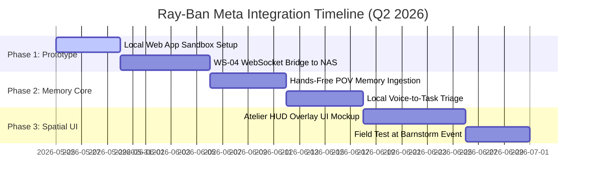

# 🕶️ Strategic Brief: Ray-Ban Meta Wearables Integration
## Creative Liberation Engine V6 Strategy — Q2 2026

> **Author:** AVERI (ATHENA / VERA / IRIS)  
> **Route:** STRATEGIC | **Priority:** High  
> **Target Document:** [RAYBAN_META_STRATEGIC_BRIEF.md](file:///y:/creative-liberation-engine/docs/RAYBAN_META_STRATEGIC_BRIEF.md)  
> **Strategic Question:** *"Does integrating Ray-Ban Meta glasses make artists more free or less free?"*

---

## 1. Executive Takeaway

The release of Meta's **Wearables Device Access Toolkit** (supporting native iOS/Android SDKs and standalone HTML/CSS/JS Web Apps) represents a massive paradigm shift for spatial interfaces. Integrating this platform into Creative Liberation Engine V6 directly advances **Artist Liberation** by solving the "manual capture friction" bottleneck of the Memory Spine. 

By utilizing the glasses' first-person camera, audio streaming, and in-lens HUD, we can construct the **Atelier Spatial HUD**—a sovereign, hands-free creative co-pilot. Crucially, we bypass Meta's data harvesting by routing all raw sensor and voice feeds through our local **WS-04 Travel Router / VLAN sovereign bubble** to our private **NAS compute node** (Ollama/local Whisper/Qwen-VL). 

This transforms the glasses from a proprietary Meta telemetry node into a sovereign, artist-owned edge interface. **We recommend immediate integration as an edge interface under the WS-04 Split-Compute Workstream.**

```
               [ Decision Pyramid ]
                       /\
                      /  \   RECOMMENDATION: Build the "Atelier Spatial HUD"
                     /____\  as a sovereign edge interface under V6 WS-04.
                    /\    /\
                   /  \  /  \  PILLAR 1: Real-time hands-free capture for Memory Spine.
                  /____\/____\ PILLAR 2: In-lens HUD composition grids & lighting references.
                 /\    /\    /\
                /  \  /  \  /  \ PILLAR 3: Localized split-compute routing via NAS.
               /____\/____\/____\
```

---

## 2. Issue Tree

```
How can Creative Liberation Engine maximize the Ray-Ban Meta SDK to liberate artists?
 ├── 1. Capture Friction (How do we ingest real-world creative context hands-free?)
 │    ├── 1.1 First-Person Visual Ingestion (Send snapshots/color/textures to Memory Spine)
 │    └── 1.2 Ambient Audio Dictation (Stream voice ideas directly to local Whisper instance)
 ├── 2. Spatial UI/UX (How do we project active creative guidance onto physical canvas?)
 │    ├── 2.1 Composition HUD Overlay (Project Rule of Thirds/Golden Ratio on studio shoots)
 │    └── 2.2 ATELIER Mood-Board Sync (Show visual references directly in the visual field)
 └── 3. Sovereignty & Compute (How do we run this without letting Meta own the artist's data?)
      ├── 3.1 Local VLAN Tunneling (Force data through the WS-04 travel bubble to private NAS)
      └── 3.2 Offline-First Fallbacks (Implement Web App sandbox to cache capture when disconnected)
```

---

## 3. Findings

### A. The Capability Surface: Meta Wearables Device Access Toolkit
Based on our technical audit of the Wearables SDK, two implementation tracks are available:
1. **HTML5/JS Web Apps (Recommended Primary)**
   * **Attributes:** Runs natively on the glasses' display, previewed in-browser, deployed via standard URLs.
   * **Data Access:** Full access to device motion/orientation, phone GPS, touch control gestures (Meta Neural Band pinch/scroll), and local storage.
   * **Strategic Fit:** Extremely high. We can host this directly on our NAS-based web server and serve it locally, making deployment and iteration instantaneous without App Store approval loops.
2. **Native iOS/Android SDKs (Secondary/Advanced)**
   * **Attributes:** Native Swift/Kotlin bridges running on a paired phone.
   * **Data Access:** Deeper hardware hooks, including raw camera visual streams and direct audio buffering.
   * **Strategic Fit:** Essential for continuous, low-latency spatial visual processing (e.g., real-time depth mapping).

### B. Core Use Cases for Creative Liberation Engine V6

#### 1. The "Atelier Spatial HUD" (Creative Guidance)
Integrating directly with the **ATELIER** (`y:\creative-liberation-engine\ATELIER`), we project grids, camera aspect-ratio frames, and dynamic lighting coordinates directly onto the physical environment.
* **Mood Board Casting:** Pull images from references (`refero/`, `godly/`) and render them as semi-transparent HUD overlays to guide live set design.
* **Color Target Analysis:** Snapshot a physical object, identify its dominant hex codes using local vision models, and alert the artist if they match or deviate from the ATELIER design library palette.

#### 2. The Hands-Free Memory Spine Bridge (Ingestion)
Currently, writing to the **Memory Spine** (`docs/MEMORY_SPINE.md`) requires manual text input or web imports.
* **Spatial Memory Snapshotting:** A simple double-tap on the glasses frame captures a 1080p POV snapshot of a drawing, scene, or lighting setup, tags it with GPS/time, and pipes it directly to the NAS RAG database.
* **Ambient Voice Logs:** A voice-activated command (*"CLE, record note..."*) streams audio directly to our local Whisper node on the Ryzen/RTX 4090 workstation, automatically logging transcription to `OPEN_ITEMS.md` or updating `task.md`.

#### 3. Sovereign Split-Compute Orchestration
Normally, smart glasses push all visual and audio context to Meta's public clouds. By anchoring the glasses to the **CLE travel bubble (GL.iNet travel router)**:
* All network packets are routed via SSH/VPN tunnels directly to the home NAS server.
* The phone's local storage and the Web App's memory cache act as secure holding buffers when working in remote offline locations.

---

## 4. Actions & Roadmap

We propose integrating Ray-Ban Meta access into the existing **V6 Q2 Ideation Workstream Matrix**:



### Immediate Action Items

* **Step 1: Set up the Local Web App Sandbox (Under WS-04: Split-Compute)**
  Build a lightweight, highly styled Web App (`apps/cle-hud-lens/`) using standard HTML5/JS. Leverage glassmorphism UI styles defined in `docs/DESIGN.md` (smooth spring-based kinetic transitions).
* **Step 2: Establish the Private Local Tunneling Protocol**
  Configure the GL.iNet Beryl AX travel router to establish an isolated VLAN for the paired smartphone and glasses, forcing all outbound API requests through the local NAS wireguard tunnel.
* **Step 3: Integrate with local Vision & Voice Nodes**
  Create a gateway handler on the NAS `gateway/` service to receive POV image files, instantly passing them to the local Qwen-VL model for tag generation, then feeding the results to the Memory Spine.

---

## 5. Risks & Failsafes

| Risk | Impact | Mitigation Strategy |
|------|--------|---------------------|
| **Meta API Lock-out** | High | Meta may restrict local direct IP connections. **Failsafe:** Maintain a secure cloud relay agent (`WS-08`) that acts as a proxy, stripping all metadata and identifying indicators before uploading. |
| **Edge Compute Latency** | Medium | Processing heavy vision models on the edge can cause lag. **Failsafe:** Perform low-cost pre-filtering (downscaling, keyframe detection) on the paired mobile phone before sending to the 4090 NAS. |
| **Battery Drain** | Medium | Active camera and WiFi connections deplete battery. **Failsafe:** Use motion-triggered and interval-based activation rather than continuous raw streaming. |

---

> *"Liberating the artist means owning the eyes through which they see the world. We must build the sovereign lens."*  
> **Collective Consensus:** Approved for immediate design incubation.
