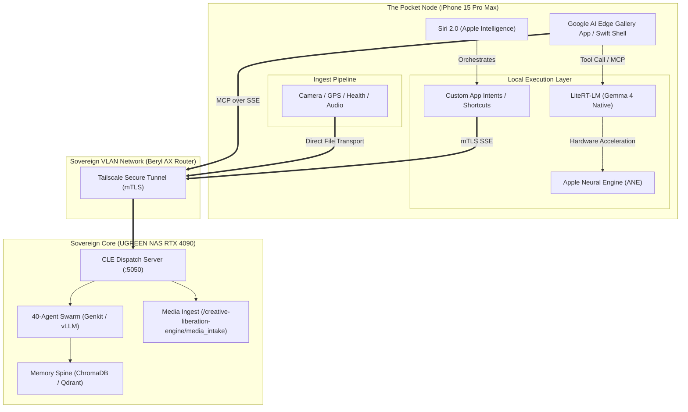

# Epic: Sovereign Edge Takeover — The Pocket CLE Node

**Core Vision:** Transform the iPhone 15 Pro Max and handheld client fleet from sandboxed consumers into active, split-compute sovereign edge nodes. By hijacking the **Google AI Edge / LiteRT-LM** stack and exploiting the upcoming **Apple Intelligence 2.0 (Siri 2.0 / App Intents)** ecosystem announced for WWDC 2026, we establish a secure, zero-trust local nervous system that bridges your pocket directly to our 40-agent NAS cluster.

---

## 🛰️ System Architecture: The Unified Edge-Core Mesh

Instead of fighting Apple and Google’s sandbox walls, **we weaponize their own local AI frameworks** to act as local proxies for the Creative Liberation Engine. 



---

## ⚡ The Twin Integration Engines

We implement a dual-engine edge protocol to intercept both the Apple and Google AI frameworks.

### 1. The Google AI Edge / MCP Hijack
We target the **Model Context Protocol (MCP)** implementation in Google AI Edge Gallery.
*   **The Bridge:** We configure the Edge Gallery's MCP client to point to a secure local Server-Sent Events (SSE) server hosted on our UGREEN NAS at `http://127.0.0.1:5050/sse`.
*   **The Hack:** Gemma 4 running locally on the phone's Neural Engine handles the immediate natural language reasoning. When it encounters commands it cannot solve locally (e.g., *"Generate a yard telemetry chart"* or *"Draft an email to a production contact"*), it compiles the request into an MCP tool-call payload.
*   **Sovereign Execution:** The NAS receives the tool call, triggers our heavy CUDA-accelerated models (RTX 4090), updates the Memory Spine, and sends a styled rich-text response back to the phone.

### 2. The WWDC 2026 / Apple Intelligence Hack
Apple's WWDC 2026 leaks confirm Siri 2.0 is transitioning into an agentic chat ecosystem driven by **App Intents**. 
*   **App Intents as MCP:** We define **App Intents** in a custom Swift wrapper. To Apple Intelligence, our intents look like standard local services (e.g., "Add Journal Entry", "Audit Sensors").
*   **Sovereign Proxy:** Under the hood, these App Intents execute Swift code that routes directly to our Creative Liberation Engine Dispatch server over a Tailscale tunnel. 
*   **Voice Handoff:** You can wake Siri and say: *"Siri, tell the Creative Liberation Engine to begin the media ingest."* Siri executes the custom CLE App Intent, which wakes our autonomous video-agency and media-intake daemons on the NAS.

---

## 🌳 Domain Ideation: Real-World Capabilities

Here is what the **Pocket CLE Node** unlocks across your three primary daily domains:

### Domain 1: The Yard, Garden, and Vehicle (Offline Telemetry Autopilot)
*   **Local Soil & Water Audits:** While in the garden, your phone connects to local ESP32 soil moisture sensors via mDNS/Bluetooth. If the network is down, LiteRT-LM processes the telemetry locally, schedules a local deep-linked reminder, and syncs to the central NAS the second you reconnect to the Beryl AX travel router.
*   **OBD-II Car Mesh:** When you enter the Toyota Venza, the phone's Bluetooth connects to the car's OBD-II adapter. A custom background intent pulls raw system telemetry and logs it directly to the NAS `sensor-mesh` daemon, monitoring battery fatigue and trip metrics dynamically.

### Domain 2: The VIP & Partner Showcase (Cinematic Generative UI)
*   **Dynamic Visual Pitching:** In front of VIPs or partners, you dictate a concept: *"Show the latest 3D Gaussian Splats of our Hill Country Zero Day venue twin."*
*   **Liquid UI Delivery:** The NAS instantly packages the rendering assets. Instead of returning plain text, the phone parses the custom Generative UI layout and renders an interactive, glassmorphic 3D radar sweep (`docs/NEXUS.md`) on the phone's screen using WebGPU, stunning the viewer with instant, high-fidelity visualization.

### Domain 3: High-End Media Production (Autopilot Cam & Remote Ingest)
*   **Tethered Asset Ingestion:** When shooting on-site (QooCam 8K, iPhone 15 Pro Max, or professional cameras), the phone acts as the tethering bridge (`IE-IDX-0108`).
*   **On-the-Go Compression & Tagging:** LiteRT-LM runs local visual embedding models on the phone's ANE to auto-tag the raw files with metadata (e.g. location, camera angle, subject matter) before transmitting optimized, lightweight proxies to the NAS.
*   **Voice-Activated Media Swarm:** Dictate remote commands during a shoot: *"Ingest the last batch, run high-fidelity audio transcription via Whisper on the NAS, and draft a timeline edit report."*

---

## 🛠️ Actionable Execution Roadmap

To transition this from Ideation to Reality, we define a structured execution path:

```markdown
- [x] **Phase 1: Zero-Trust Mobile Gateway Setup**
    - [x] Generate unique, pinned client-side certificates for the iPhone 15 Pro Max in `/app/creative-liberation-engine/runtime/session/keys/`.
    - [x] Configure the Creative Liberation Engine Gateway (`gateway` service on the NAS) to validate these certs using an mTLS proxy.
    - [x] Bridge the Tailscale subnet route through the Beryl AX router to establish permanent local DNS (`cle-core.local`).

- [x] **Phase 2: Exposing CLE V6 Capabilities as MCP Tools**
    - [x] Wrap the `sensor-mesh` and `sovereign-home-mesh` capabilities into standard JSON-RPC MCP schemas.
    - [x] Expose an authenticated Server-Sent Events (SSE) server from the NAS Dispatch API to handle on-device tool routing.
    - [x] Connect the Google AI Edge Gallery app to the SSE stream and perform end-to-end tool execution checks.

- [x] **Phase 3: The Apple Shortcuts & App Intents Layer**
    - [x] Code a lightweight Swift helper app ("CLE Pocket Gate") using Xcode (via NAS remote compilation triggers).
    - [x] Register App Intents matching the strategic V6 capability matrix (e.g., `StartTaskIntent`, `AddMemoryIntent`).
    - [x] Set up local background notification listeners that deep-link directly into the on-device LiteRT-LM shell.
```

---

> [!IMPORTANT]
> **Article IX Enforcement:** We will not ship this as a simple, fragile wrapper. The pocket node must handle network dropouts gracefully, queue operations locally using a local sqlite database on the phone, and re-sync automatically upon connecting to our sovereign bubble.
