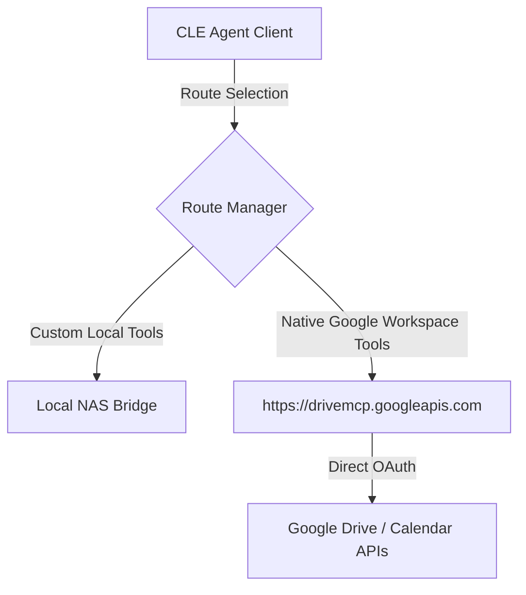

# Google Native Hosted Model Context Protocol (MCP) Services Reference

Google now provides official, native **Model Context Protocol (MCP) servers** hosted directly on Google Infrastructure. Rather than configuring a custom API bridge that translates MCP schemas into Google Workspace SDK calls, AI agents can query the official Google Workspace endpoints directly.

---

## 1. Supported Endpoints & Services

The official Google Workspace MCP servers are exposed via global Google API endpoints running over the **Streamable HTTP** transport protocol (with SSE support for legacy clients).

| Service | MCP API Endpoint | Scope Requirements | Supported Tools (Examples) |
| :--- | :--- | :--- | :--- |
| **Google Drive** | `https://drivemcp.googleapis.com/mcp/v1` | `drive.readonly`, `drive.file` | `list_files`, `search_files`, `get_file_content`, `create_file` |
| **Google Calendar** | `https://calendarmcp.googleapis.com/mcp/v1` | `calendar.events` | `list_events`, `create_event`, `delete_event`, `find_free_busy` |
| **Gmail** | `https://gmailmcp.googleapis.com/mcp/v1` | `gmail.modify`, `gmail.labels` | `list_messages`, `get_thread`, `label_thread`, `send_draft` |

---

## 2. Authentication & Protocol Transport

### OAuth 2.0 Access Tokens
Connection to the hosted endpoints requires a standard Google OAuth 2.0 Access Token passed in the HTTP headers of the Streamable HTTP request:

```json
{
  "Authorization": "Bearer ya29.a0AfH6SM..."
}
```

### Streamable HTTP Transport
Unlike standard local stdin/stdout subprocess transports, remote hosted servers interact via standard JSON-RPC over HTTP POST requests.

#### Client Request Example (Tools Listing)
```http
POST https://drivemcp.googleapis.com/mcp/v1/tools/list
Authorization: Bearer <ACCESS_TOKEN>
Content-Type: application/json

{
  "jsonrpc": "2.0",
  "method": "tools/list",
  "params": {}
}
```

---

## 3. Comparison: Self-Hosted vs. Native Google-Hosted

We currently deploy `google-workspace-mesh-bridge` on our NAS to act as an intermediate translator. Here is how Google's hosted service compares to our current setup:

| Feature | Self-Hosted Bridge (`google-workspace-mesh-bridge`) | Native Google-Hosted MCP Services |
| :--- | :--- | :--- |
| **Infrastructure** | Runs as a Docker container on our Synology NAS (Port 3000) or proxy workstation. | Hosted globally by Google; serverless, zero local compute cost. |
| **Code Maintenance** | We must write Zod input schemas, map OAuth clients, and maintain tool resolver functions in Express.js. | Zero code maintenance. Tool definitions are automatically updated and kept in sync by Google. |
| **API Coverage** | Limited to custom-implemented tools (`drive_search_files`, `drive_read_file`, `calendar_list_events`, etc.). | Full coverage of Drive, Calendar, and Gmail capabilities out-of-the-box. |
| **Authentication Flow** | Handled locally via environment variables (`GMAIL_REFRESH_TOKEN`, client ID/secrets). | Handled directly at Google’s API Gateway level using the active user's OAuth credentials. |

---

## 4. Implementation Design: Hybrid Routing

To optimize our stack, we can deprecate the custom tool registration code inside `google-workspace-mesh-bridge` and transition to a **hybrid routing model**:



1.  **Direct Client Connections:** If the agent runs inside a tool supporting authenticated headers (like Claude Desktop or our local client), configure it to talk directly to `https://drivemcp.googleapis.com/mcp/v1` and `https://calendarmcp.googleapis.com/mcp/v1`, passing the user's OAuth access token.
2.  **Proxy Routing:** For headless agents executing on the NAS, the `google-workspace-mesh-bridge` will continue to handle token refresh cycles using `GOOGLE_OAUTH_CLIENT_SECRET` and `GMAIL_REFRESH_TOKEN`, but will act as a thin client proxy forwarding standard JSON-RPC requests directly to Google's hosted endpoints.
